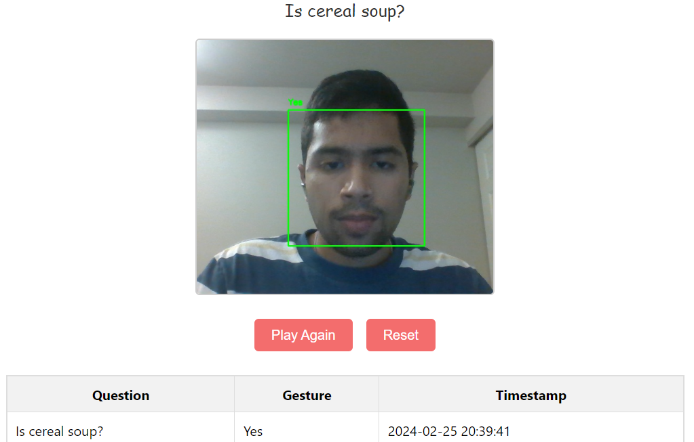

# Nod-o-meter

Nod-o-meter is a high-tech nod tracking app that uses your webcam to answer questions by nodding your head. It's not your average nodding game; it's designed to uncover the deepest secrets of your nods! Are you ready to nod your way to enlightenment? Let the nodding begin!

## Demo

## Usage

1. Clone this repo.
2. Install requirements `pip install -r requirements.txt`
3. Run app `python web/app.py`
4. Click `Start` to begin logging, then click on `Play` to start playing *nod-o-meter*.
5. Nod your head vertically to answer "yes" and shake your head to answer "no".
6. The app will log your **first** response in the log table below. 
7. To continue playing click on `reset` followed by `play again`.
8. Enjoy :p

## Features

-  [x] **RealTime Webcam nod tracking**: Uses live webcam feed for nod tracking
-  [x] **Question Prompt**: Provides a variety of questions to answer
-  [x] **Logging**: Logs your responses for each question
-  [x] **Documentation** ReadMe with added Issues(features enhancements, bugs etc) + demo video
-  [ ] **Dockerize** the app for easier deployment (*wip - rectify link to webcam from container*)

## Further Enhancements

* [ ] Improve the computer vision algorithm for more accurate nod tracking (TBD)
* [ ] Generate questions using a large language model (LLM) for more personalized experiences (TDB)
* [ ] Improve the user interface

## Bug Reports and Open Source Contribution

Please report any bugs you find to the [issues page](https://github.com/Saharsh1005/human_nod/issues). We welcome open source contributions!

## Contributor
[ <b>Saharsh</b>](https://github.com/your-username)

## Repo Link
Github repo link: https://github.com/Saharsh1005/nod-o-meter
